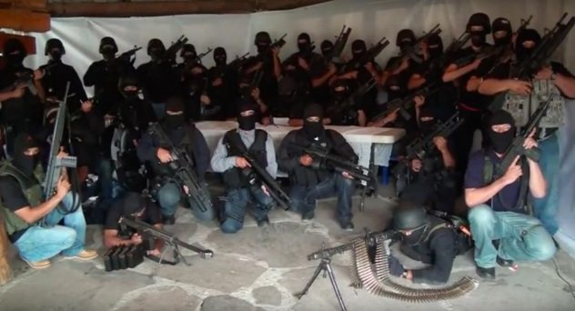

# The appearance of Loz-Zetas

> Originated in the late 1990s

- Tamaulipas is a Mexican state that borders Texas. It is home to the city of Nuevo Laredo, which handles roughly 40% of trade with the US.
- In the midst of legal trade happening in Nuevo Laredo, an illicit underbelly started to take shape in the 1930s, as an organization began to develop around the region’s illegal trade.
- Juan N. Guerra started smuggling whiskey among other products into the US during the prohibition. As he expanded his business, he established (corrupt) political ties as a known smuggler in the region.
- During the 1980s, the USA largely uprooted drug smuggling routes in the Caribbean. Mexico became a crucial stop on the route into the US for Colombian drug traffickers. Juan Garcia Abrego, the successor to Juan N. Guerra, negotiated a deal with the Cali Cartel in Colombia. They would provide a trade route for drugs in exchange for half of the product. This was the beginning of the Gulf Cartel (CDG), which only grew in scope over the next decade or so.
- After Juan Garcia Abrego’s capture, the Gulf Cartel faced a complex web of succession, ultimately ending with a man named Osiel Cardenas, who earned the nickname El Mata-Amigos (The Friends-Killer) after murdering his friend in order to secure leadership. This foreshadowed some of the violence that was to come under his leadership, most notably, the formation of Los Zetas.
- Los Zetas was initially formed from deserters from the Mexican Army. They were well-trained military professionals, possibly even having received training from foreign governments such as the United States.
- Los Zetas functioned as kind of private military for the Gulf Cartel. They now worked with the very cartels they’d been trained to fight.
- Los Zetas continued to grow, offering better salaries than the military.
- Los Zetas outclassed the enforcement of every other cartel at the time, being the first truly “militarized” enforcers employed by a cartel.
- Los Zetas stopped other cartels from infiltrating the key city of Nuevo Laredo.

