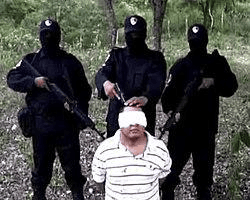

# Who is Los-Zetas?

> One of the most dangerous of Mexico’s drug cartels

- Engage in “shock and awe” tactics with the intention of paralyzing other cartels in fear of their militarized ways
- Use fear as a first resort instead of corruption
- Main strength is their expertise in tactical warfare
- One of their main objectives is to target police and military forces & war with their federal government

## The evil they've done

- Indiscriminate murder, beheading, torture
- In addition to attacking other cartels, Los Zetas has carried out multiple massacres on civilians
- In 2011 they killed 52 people in a casino
- Captured and executed 8 Mexican Army officers in 2008
- There are also other ones that they may also be responsible for

> More articles about it

[>>Zetas ejecutaron por la espalda a los 72 migrantes; no pudieron pagar rescate](https://www.jornada.com.mx/2010/08/26/politica/002n1pol)

[>>2011 San Fernando massacre](https://en.wikipedia.org/wiki/2011_San_Fernando_massacre)

Los Zetas Inc by Guadalupe Correa-Cabrera
